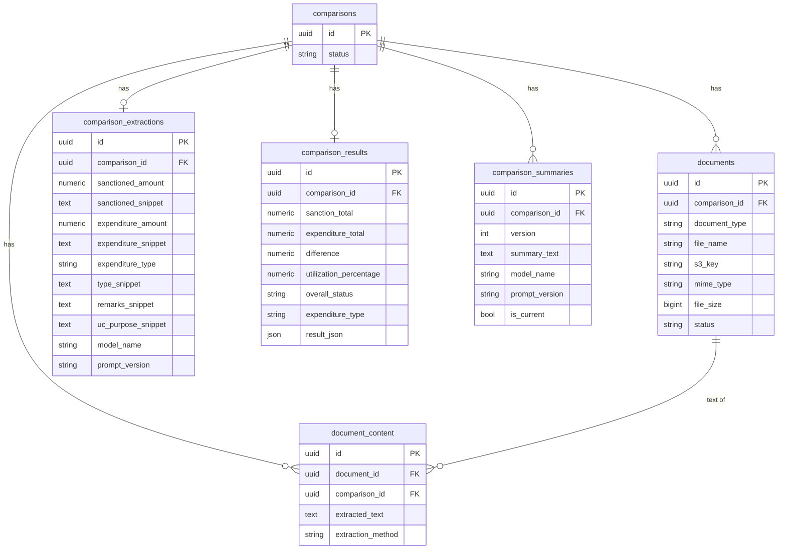

# Database Schema

Source of truth is `backend/app/models.py` — if this file and the code ever
disagree, the code wins; update this file to match.

All 6 tables share the same pattern: every table (except `comparisons`
itself) carries a `comparison_id` foreign key, so the full record of one
comparison can always be pulled with a single `WHERE comparison_id = ?`
across every table. Every table also has `created_at` / `updated_at`
(`TimestampMixin`), omitted from the column lists below to avoid repeating
them six times — both are `TIMESTAMPTZ`, `created_at` defaults to `now()`,
`updated_at` defaults to `now()` and is re-set to `now()` on every update.

Column types are declared dialect-agnostically (`Uuid`, `Numeric`, `JSON`)
so the same models run on Postgres in production and SQLite in tests; on
Postgres, `Uuid` maps to native `UUID` and `JSON` to `JSONB`.

No migration tool is set up yet (Alembic is the natural next step once real
data matters) — see `local-setup.md` § Schema changes for how to apply a
column change to an already-running dev database.

## Entity relationship

`comparison_extractions` and `comparison_results` are drawn `||--o|`
(zero-or-one) because in practice there's at most one row per comparison —
`confirm` upserts the single result row rather than versioning it (only
summaries are versioned). Nothing in the schema enforces that as a DB-level
uniqueness constraint yet; it's an application-level invariant. `documents`
and `document_content` are `||--o{` because there are always exactly two
(SANCTION + UC), but the FK allows more.

## comparisons
One row per comparison — the anchor every other table hangs off.

| Column | Type | Null? | Default | Notes |
|---|---|---|---|---|
| id | UUID | PK | `uuid4()` | comparison_id used everywhere else |
| status | VARCHAR(32) | no | `"CREATED"` | CREATED → PROCESSING → EXTRACTED → COMPARING → COMPLETED, or FAILED |
| created_at | TIMESTAMPTZ | no | `now()` | |
| updated_at | TIMESTAMPTZ | no | `now()` | |

## documents
The two uploaded originals (one SANCTION, one UC) — metadata only; the
bytes live in S3 at `s3_key`.

| Column | Type | Null? | Default | Notes |
|---|---|---|---|---|
| id | UUID | PK | `uuid4()` | |
| comparison_id | UUID | no | — | FK → comparisons.id |
| document_type | VARCHAR(16) | no | — | `"SANCTION"` \| `"UC"` |
| file_name | VARCHAR(255) | no | — | original upload filename |
| s3_key | VARCHAR(512) | no | — | `comparisons/<id>/<sanction\|uc>/<file>` |
| mime_type | VARCHAR(128) | no | `""` | e.g. `application/pdf` |
| file_size | BIGINT | no | `0` | bytes |
| status | VARCHAR(32) | no | `"UPLOADED"` | |
| created_at | TIMESTAMPTZ | no | `now()` | |
| updated_at | TIMESTAMPTZ | no | `now()` | |

## document_content
The extracted plain text of one document, kept separately from `documents`
so a large text blob doesn't bloat every metadata query.

| Column | Type | Null? | Default | Notes |
|---|---|---|---|---|
| id | UUID | PK | `uuid4()` | |
| document_id | UUID | no | — | FK → documents.id |
| comparison_id | UUID | no | — | FK → comparisons.id (denormalized for one-query lookup) |
| extracted_text | TEXT | no | `""` | full OCR/PDF text |
| extraction_method | VARCHAR(32) | no | `""` | `"TEXT"` (pdfplumber) \| `"TEXTRACT"` |
| created_at | TIMESTAMPTZ | no | `now()` | |
| updated_at | TIMESTAMPTZ | no | `now()` | |

## comparison_extractions
The fields the LLM picked from the two documents' text, plus the exact
snippet each was taken from (traceability) and which model/prompt version
produced them.

| Column | Type | Null? | Default | Notes |
|---|---|---|---|---|
| id | UUID | PK | `uuid4()` | |
| comparison_id | UUID | no | — | FK → comparisons.id |
| sanctioned_amount | NUMERIC(18,2) | **yes** | — | null when the LLM couldn't confidently find it |
| sanctioned_snippet | TEXT | no | `""` | source quote |
| expenditure_amount | NUMERIC(18,2) | **yes** | — | null when not found |
| expenditure_snippet | TEXT | no | `""` | source quote |
| expenditure_type | VARCHAR(255) | no | `""` | |
| type_snippet | TEXT | no | `""` | source quote |
| remarks_snippet | TEXT | no | `""` | verbatim balance/refund remark, if the UC states one |
| uc_purpose_snippet | TEXT | no | `""` | category the UC actually recorded spend against, if it's a breakdown table |
| model_name | VARCHAR(128) | no | `""` | e.g. `global.anthropic.claude-sonnet-4-6` |
| prompt_version | VARCHAR(32) | no | `""` | e.g. `extraction_v4` |
| created_at | TIMESTAMPTZ | no | `now()` | |
| updated_at | TIMESTAMPTZ | no | `now()` | |

Only `sanctioned_amount` and `expenditure_amount` are nullable — every other
column always has a value (possibly an empty string) so callers never need
to distinguish "not found" from "found but empty" for the text fields.

## comparison_results
The Python-computed numbers. The LLM never touches this table — see
`services/comparison.py`.

| Column | Type | Null? | Default | Notes |
|---|---|---|---|---|
| id | UUID | PK | `uuid4()` | |
| comparison_id | UUID | no | — | FK → comparisons.id |
| sanction_total | NUMERIC(18,2) | no | — | the confirmed sanctioned amount |
| expenditure_total | NUMERIC(18,2) | no | — | the confirmed expenditure amount |
| difference | NUMERIC(18,2) | no | — | sanction_total − expenditure_total |
| utilization_percentage | NUMERIC(7,2) | no | — | expenditure_total / sanction_total × 100 |
| overall_status | VARCHAR(32) | no | — | FULLY_UTILIZED \| UNDER_UTILIZED \| OVER_UTILIZED |
| expenditure_type | VARCHAR(255) | no | `""` | copied from the confirm request |
| result_json | JSON | no | `{}` | small computed-values snapshot (see confirm handler) |
| created_at | TIMESTAMPTZ | no | `now()` | |
| updated_at | TIMESTAMPTZ | no | `now()` | |

## comparison_summaries
Every generated summary, versioned — `regenerate` adds a new row rather
than overwriting; exactly one row per comparison has `is_current = true`.

| Column | Type | Null? | Default | Notes |
|---|---|---|---|---|
| id | UUID | PK | `uuid4()` | |
| comparison_id | UUID | no | — | FK → comparisons.id |
| version | INTEGER | no | — | 1, 2, 3… increasing per comparison |
| summary_text | TEXT | no | — | the plain-English result |
| model_name | VARCHAR(128) | no | `""` | |
| prompt_version | VARCHAR(32) | no | `""` | e.g. `summary_v2` |
| is_current | BOOLEAN | no | `false` | exactly one true row per comparison_id |
| created_at | TIMESTAMPTZ | no | `now()` | |
| updated_at | TIMESTAMPTZ | no | `now()` | |

## Deleting a comparison
`DELETE /api/comparisons/{id}` removes rows from all six tables for that
`comparison_id`, in FK-safe order (children before `comparisons`), plus
both S3 originals. See `app/api/comparisons.py::delete_comparison`. There
are no `ON DELETE CASCADE` constraints defined — deletion order is handled
in application code, not by the database.
